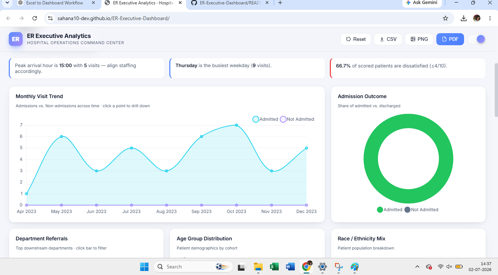
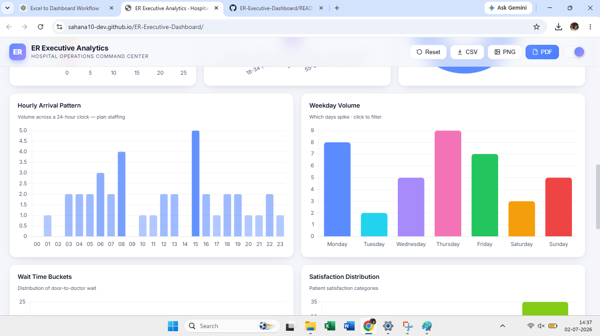
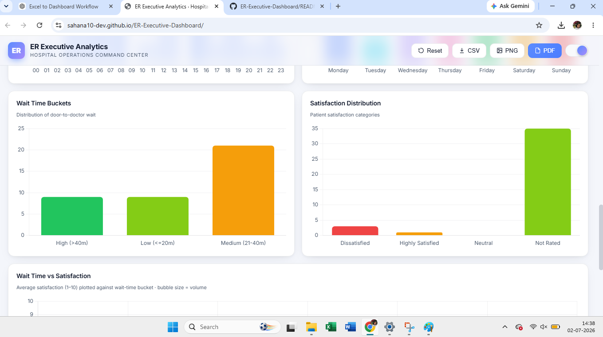

# 🏥 ER Executive Dashboard

## 📌 Project Overview

The ER Executive Dashboard is an interactive web application designed to visualize hospital emergency room performance using key performance indicators (KPIs), interactive charts, and responsive design.

## 🚀 Live Demo

🌐 https://sahana10-dev.github.io/ER-Executive-Dashboard/

## 🛠️ Technologies Used

- HTML5
- CSS3
- JavaScript
- Chart.js
- AI-assisted development

## ✨ Features

- Interactive KPI Cards
- Monthly Visit Trends
- Admission Outcome Analysis
- Department Referrals
- Patient Demographics
- Hourly Arrival Pattern
- Responsive Dashboard

## 📷 Dashboard Preview

### Dashboard Overview

### Monthly Trends

### Patient Demographics

### Operations Dashboard

## 👩‍💻 Author

**Sahana G N**
